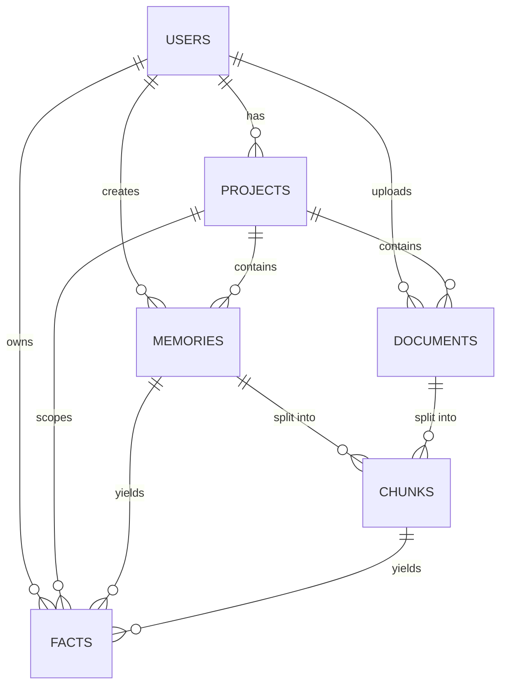

# Memwyre Database Schema

Memwyre uses a hybrid storage model where structured relational data is stored in PostgreSQL (or SQLite for local setups) and vector data is stored in Pinecone (or ChromaDB locally). Below is the comprehensive relational schema covering the core data entities.

## Core Entities & Relationships

### 1. `users` Table
Handles user identity and authentication.
- `id` (PK, Integer)
- `email` (String, Unique)
- `name` (String, nullable)
- `created_at` (DateTime)

### 2. `projects` Table
Provides containerization and scope separation for multi-tenancy workspaces.
- `id` (PK, Integer)
- `user_id` (FK -> users.id)
- `name` (String)
- `description` (String, nullable)
- `color` (String, default: "#D97757")
- `icon` (String, default: "folder")
- `created_at` (DateTime)
- `archived_at` (DateTime, nullable)

### 3. `memories` Table
Core conversational and extracted memory states.
- `id` (PK, Integer)
- `user_id` (FK -> users.id)
- `project_id` (FK -> projects.id, nullable)
- `title` (String, nullable)
- `content` (Text)
- `tags` (JSON, nullable)
- `embedding_id` (String, ID in Vector DB)
- `source_llm` (String, default: "user")
- `status` (String, default: "approved") - Values: pending, approved, merged, discarded
- `show_in_inbox` (Boolean, default: True)
- `created_at` (DateTime)

### 4. `documents` Table
Represents uploaded files, pages, and structured imports.
- `id` (PK, Integer)
- `user_id` (FK -> users.id)
- `project_id` (FK -> projects.id, nullable)
- `title` (String)
- `content` (Text, nullable)
- `source` (String, nullable)
- `file_type` (String, nullable)
- `doc_type` (String, default: "file")
- `tags` (JSON, nullable)
- `created_at` (DateTime)

### 5. `chunks` Table
Semantic chunks derived from documents or memories, synced directly to the Vector DB.
- `id` (PK, Integer)
- `document_id` (FK -> documents.id, nullable)
- `memory_id` (FK -> memories.id, nullable)
- `chunk_index` (Integer)
- `text` (Text)
- `embedding_id` (String, ID in Vector DB)
- `summary` (Text, nullable)
- `trust_score` (Float, default: 0.5)
- `metadata_json` (JSON, nullable)
- `tags` (JSON, nullable)

### 6. `facts` Table
Atomic, temporal Subject-Predicate-Object triples forming the knowledge graph.
- `id` (PK, Integer)
- `user_id` (FK -> users.id)
- `project_id` (FK -> projects.id, nullable)
- `memory_id` (FK -> memories.id, nullable)
- `chunk_id` (FK -> chunks.id, nullable)
- `subject` (String)
- `predicate` (String)
- `object` (String)
- `confidence` (Float, default: 1.0)
- `valid_from` (DateTime)
- `valid_until` (DateTime, nullable) - Determines supersession
- `is_superseded` (Boolean, default: False)
- `created_at` (DateTime)

---

## Entity Relationship Diagram

### Fact Supersession & Containerization
- **Supersession**: When a new fact matching the same `subject` and `predicate` is written (e.g. user moves from Berlin to Tokyo), the database marks the old record's `is_superseded` flag as `true` and updates `valid_until` to the current timestamp. This guarantees that temporal inquiries return state-accurate facts.
- **Containerization**: Every memory, document, chunk, and fact contains a `project_id`. When querying, filters strictly enforce containment matching the current workspace's `project_id`, preventing leakage across different project environments.
