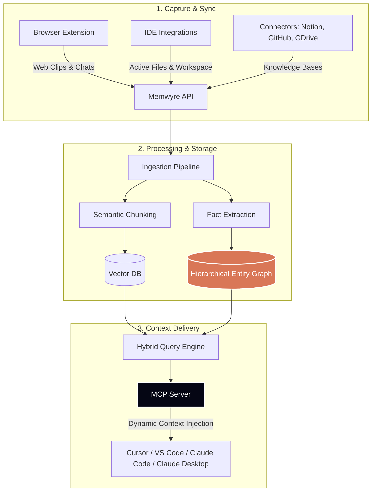

Memwyre captures knowledge from your workflows, processes it using a hybrid vector-graph model, and delivers it on-demand to your AI tools via the **Model Context Protocol (MCP)**.

## The Ingestion & Retrieval Lifecycle

1. **Capture** — Save text blocks, code snippets, Slack chats, or documentation from the browser extension, native connectors, or CLI.
2. **Ingest & Structure** — Incoming data is parsed. The system splits text into semantic chunks and uses LLMs to extract atomic facts (subject-predicate-object relationships), storing them in a hierarchical entity graph.
3. **Retrieve** — When you prompt your AI, Memwyre uses hybrid search (combining dense vector retrieval with graph traversal) to resolve exactly which projects, files, and rules apply to your query, serving them instantly.

---

Here are the core concepts you need to know:

## 1. Capture Your Knowledge

You save documents, articles, transcripts, or developer notes to your Memwyre vault. This can be done via:

- **The Browser Extension** — Bookmark articles, chat logs, or text selections as you read.
- **Integrations** — Automatically sync work directories and files.
- **The API & CLI** — Send context directly from your terminal or custom scripts.

---

## 2. Auto-Updating Context

Memwyre keeps your memories current. If you save a note that contradicts or updates a previous entry, the system automatically surfaces the most recent update. This prevents your AI tools from getting confused by outdated codebase guidelines, changed API endpoints, or stale project descriptions.

---

## 3. Dynamic Context Injection

When you prompt a connected AI client (such as Cursor, VS Code, or Claude Desktop):

1. **Analysis** — Memwyre looks at your prompt to understand the topics and projects you are referring to.
2. **Selection** — It retrieves the most relevant guidelines, snippets, and project rules from your vault.
3. **Injection** — The context is formatted and appended to your prompt block in the background. The LLM receives the prompt with the exact context it needs to provide an accurate response.

---

## The Processing Pipeline

When you save content to Memwyre, it moves through the following lifecycle stages before it becomes available to your AI tools:

| Stage | Description |
| :-- | :-- |
| **Queued** | The raw capture is received and queued for processing. |
| **Extracting** | Boilerplate noise, headers, footers, and page scripts are stripped. |
| **Indexing** | Semantic vector profiles are generated and entity relationships are resolved. |
| **Ready** | The memory is fully active and searchable for prompt context injection. |

---

## Underlying Technology

Memwyre runs on a high-performance stack optimized for semantic search and graph-based relationships:

- **Vector Search Engine**: Stores and queries dense vector embeddings to perform fast semantic searches and locate conceptual themes in your documents.
- **Knowledge Graph Database**: Maps deterministic relationships between entities, ensuring exact metadata profiles and constraints are matched and retrieved accurately.
- **LLM Processing Workers**: Handles automated background pipelines for noise filtering, document cleaning, and semantic relationship extraction.
- **Model Context Protocol (MCP)**: Leverages the open standard for direct, secure connections between your local IDEs and the remote memory vault.