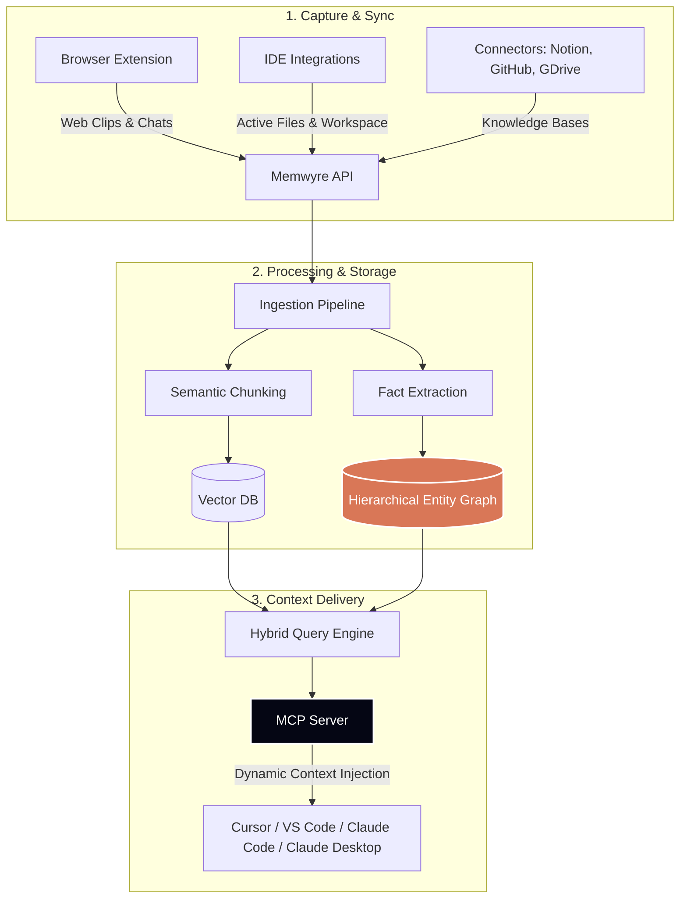

# Overview

**Memwyre** is a universal memory layer for AI — a persistent, cross-tool knowledge vault that sits between you and the AI models you use daily. 

Instead of re-explaining your project architectures to Cursor, losing context when a Claude conversation ends, or copy-pasting developer guidelines into ChatGPT, Memwyre centralizes your context. It automatically stores, structures, and dynamically injects the relevant facts into whatever AI client you are active in.

---

## How It Works

Memwyre captures knowledge from your workflows, processes it using a hybrid vector-graph model, and delivers it on-demand to your AI tools via the **Model Context Protocol (MCP)**.

1. **Capture** — Save text blocks, code snippets, Slack chats, or documentation from the browser extension, native connectors, or CLI.
2. **Ingest & Structure** — Incoming data is parsed. The system splits text into semantic chunks and uses LLMs to extract atomic facts (subject-predicate-object relationships), storing them in a hierarchical entity graph.
3. **Retrieve** — When you prompt your AI, Memwyre uses hybrid search (combining dense vector retrieval with graph traversal) to resolve exactly which projects, files, and rules apply to your query, serving them instantly.

---

## Core Pillars

### 1. Model Context Protocol (MCP)
Memwyre operates as an MCP server. This allows AI clients like Claude Desktop, Cursor, and VS Code to natively query your memory vault. The AI client can autonomously search your memories or write new memories back to your vault during a conversation.

### 2. Hierarchical Entity Graphs
Traditional RAG retrieves random text chunks based on keywords. Memwyre maps your knowledge into a graph structure. It knows that `Project A` uses `Database B` which has `Schema C`, ensuring that querying `Project A` brings in the entire context chain automatically.

### 3. Integrated Capturing Ecosystem
*   **Browser Extension**: Clip web pages, API docs, or save entire conversation histories from ChatGPT, Claude.ai, and Perplexity with one click.
*   **Ready-to-Use Connectors**: Connect Notion, GitHub, Google Drive, and Gmail to keep your memory vault continuously synchronized with your team's documents.
*   **Agent CLI Plugins**: Native terminal integrations for command-line agents like Claude Code and OpenClaw.

---

## Terminology

| Concept | Description | Database Entity |
| :--- | :--- | :--- |
| **Memory** | A raw unit of ingested text — a note, clipped article, sync'd doc, or chat history. | `Memory` |
| **Chunk** | A segmented slice of a larger Memory, vectorized for semantic retrieval. | `Chunk` |
| **Fact** | An extracted atomic truth (e.g., *Project X uses Vue 3*). Decays/updates over time. | `Fact` |
| **Entity Profile** | A compiled metadata profile representing a unique project, repository, tool, or person. | `EntityProfile` |
| **MCP Server** | The standard interface exposing Memwyre search and writing tools to client IDEs. | — |

---

## Choose Your Integration Path

Get started with the integrations that fit your workflow:

*   🌐 **Web Browser & ChatGPT** — [Browser Extension Guide](/integrations/browser-extension)
*   💻 **IDEs (Cursor, Claude Desktop, VS Code)** — [MCP Server Setup](/integrations/mcp-server)
*   🤖 **Autonomous Agents (OpenClaw, Claude Code)** — [Agent Plugins Guide](/integrations/plugins/openclaw)

---

## Quick Start (60 Seconds)

1. **Create an Account**: Sign up at [memwyre.tech](https://memwyre.tech).
2. **Install the Browser Extension**: Download the extension ([guide](/integrations/browser-extension)).
3. **Configure the Token**: Go to your dashboard settings, copy your API token, and paste it into the extension.
4. **Begin Querying**: Open your IDE or ChatGPT — Memwyre is active and ready to feed context.