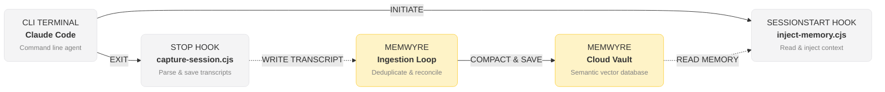

# Building Persistent Terminal Sessions: Claude Code Memory Ingestion

Anthropic's **Claude Code** is a revolutionary command-line agent that allows developers to run terminal commands, write code, search files, and fix errors directly from their shell. It is fast, lightweight, and incredibly capable. 

However, Claude Code has a major limitation: **it is completely stateless**. When you close a terminal session or exit the agent, all of Claude's contextual understanding of your debugging history, directory layout, and architectural decisions is wiped clean. When you launch it again, you start from scratch.

By integrating the **Memwyre Claude Plugin**, you can turn Claude Code into a continuous assistant with persistent memory that automatically logs, updates, and recalls your progress across terminal sessions.

---

## Deconstructing Claude Code's Undocumented Memory Limits

To understand why a dedicated memory sync plugin is necessary, we examined Claude Code's source memory directories (situated in `src/memdir/` of its distribution). Claude Code actually ships with a local file-based memory system.

### How Local Memory Works
Claude Code stores project-specific memories as plain markdown files on your local drive at:
`~/.claude/projects/<your-repo-name>/memory/`

At the root of this folder sits a file named `MEMORY.md`. On session start, Claude reads this index file and injects its contents directly into its system prompt. The source code restricts memories to four categories:
1. **User memories**: General developer details (preferences, role, communication style).
2. **Feedback memories**: Corrections and instructions on what *not* to do.
3. **Project memories**: Codebase deadlines and architectural context.
4. **Reference memories**: Pointers to external trackers (e.g., Jira keys).

### The Silent Truncation Limit
However, looking into the compiler files reveals two major limits built into Claude's local memory engine:
- **200-Line Limit**: The `MEMORY.md` index file is strictly capped at **200 lines**. If your memory file grows larger, the CLI silently truncates additional lines. It appends a tiny markdown warning inside the file itself, but because the truncation is silent, Claude receives a cut-off system prompt and has no idea that the older memories fell off the index.
- **25KB Size Limit**: A separate binary cap designed to prevent token inflation from unusually long lines.

If your codebase accumulates more than 200 lines of guidelines, the local system begins losing context. More importantly, this memory is siloed locally—it does not sync to other development devices or your IDE environments.

---

## The Memwyre Hook Solution

Memwyre overrides these local limitations by utilizing Claude Code's built-in session lifecycle hooks. By running shell scripts during initialization and termination, Memwyre links the local workspace to your secure, remote vector memory vault.



1. **Context Injection (`SessionStart`)**: The hook queries the Memwyre API for memories matched to the current repository path. It filters the most relevant facts based on similarity, recency, and importance, and writes them directly into the memory file before Claude initializes.
2. **Transcript Capture (`Stop`)**: On exit, the hook reads the local chat history file, parses the conversation using NLP, extracts new developer preferences or project specs, and sends them as memory updates to the vault.

---

## Installation & Configuration

### 1. Install the Plugin Package
Install the Memwyre Claude memory bridge globally using npm:

```bash
npm install -g @memwyre/claude-memwyre
```

### 2. Configure Claude Code Hooks
Create or edit your local Claude configuration hooks file at `~/.claude/hooks.json` to register the startup and capture scripts:

```json
{
  "description": "Memwyre: Persistent autonomous memory",
  "hooks": {
    "SessionStart": [
      {
        "hooks": [
          {
            "type": "command",
            "command": "node \"/path/to/global/node_modules/@memwyre/claude-memwyre/dist/inject-memory.cjs\"",
            "timeout": 30
          }
        ]
      }
    ],
    "Stop": [
      {
        "hooks": [
          {
            "type": "command",
            "command": "node \"/path/to/global/node_modules/@memwyre/claude-memwyre/dist/capture-session.cjs\"",
            "timeout": 30
          }
        ]
      }
    ]
  }
}
```

*Replace `/path/to/global/node_modules/` with the actual path to your global `node_modules` directory.*
- **Windows**: `%AppData%\npm\node_modules\`
- **macOS/Linux**: `/usr/local/lib/node_modules/` or `~/.npm-global/lib/node_modules/`

### 3. Add Environment Variables
Add your Memwyre API token to your terminal shell profile (`.bashrc`, `.zshrc`, or your system environment variables):

```bash
export MEMWYRE_API_KEY="your_api_token_here"
export MEMWYRE_API_URL="https://server.memwyre.tech"
```

---

## Experiencing Continuous Development

Once configured, your terminal workflow remains exactly the same, but Claude becomes contextually aware:

### Launching the Agent
When you execute `claude` in your repository folder, the script will silently retrieve past memories. Claude will boot up already knowing:
- The database schema you designed in the previous session.
- The bugs you fixed and the reasoning behind specific package configurations.
- The exact API keys or development endpoints you've whitelisted.

### Exiting the Agent
When you exit using `/exit` or `Ctrl + C`, the capture script processes the conversation transcript. It uses Memwyre's semantic memory model to summarize your changes:
```
[Memwyre] Analyzing session transcript...
[Memwyre] Captured 2 new codebase memories:
  - "Updated AuthMiddleware to handle token expiration gracefully"
  - "Configured Redis cache pool in app/config.py"
[Memwyre] Ingestion complete.
```

---

## Conclusion

With Memwyre, Claude Code becomes an extension of your own long-term memory. You no longer lose progress when switching tasks, closing terminal tabs, or rebooting your computer.

Unlock persistent terminal intelligence today at [memwyre.tech](https://memwyre.tech).

