# How to Give Claude Desktop Persistent Memory using MCP

Model Context Protocol (MCP) is a standard protocol created by Anthropic that allows local LLMs and AI clients like Claude Desktop to connect directly to external tools, databases, and APIs. However, out of the box, Claude Desktop remains **stateless**. The moment you close your active chat window or start a new thread, Claude forgets all the context, architecture details, formatting guidelines, and debugging notes from yesterday.

By connecting **Memwyre** as a secure MCP server, you can give Claude Desktop a persistent, self-improving memory layer that compiles and compounds context across all your chat sessions.

---

## The Cost of Amnesia in Development Workflows

When you use Claude Desktop for coding, research, or writing, you probably face these common friction points:
- **Repetitive context loading**: Copy-pasting your project specifications, file structures, and style guides into every single new session.
- **Lost preferences**: Re-explaining that you prefer Tailwind CSS v4, Vue 3 Composition API, or Python typing styles.
- **Repeat debugging loops**: Fixing the same compilation error over and over because Claude forgot the solution you found two hours ago.

A stateless assistant forces you to act as its external hard drive. Providing a persistent memory loop via MCP resolves this by letting Claude autonomously fetch context from a centralized vault and write back new facts as they emerge.

---

## How MCP Memory Works under the Hood

Model Context Protocol defines a client-server architecture. Claude Desktop acts as the **MCP client**, and the Memwyre daemon acts as the **MCP server**.

```mermaid
graph LR
    classDef default fill:#f4f4f5,stroke:#e4e4e7,stroke-width:1px,rx:8px,ry:8px;
    classDef highlight fill:#fef3c7,stroke:#fcd34d,stroke-width:1px,rx:8px,ry:8px;

    User["DEVELOPER<br><b>User Query</b><br><font size=2 color=gray>Ask technical question</font>"]
    Claude["CLIENT<br><b>Claude Desktop</b><br><font size=2 color=gray>AI Chat Assistant</font>"]
    MCP["MCP SERVER<br><b>Memwyre Daemon</b><br><font size=2 color=gray>mcp-server command</font>"]
    Vault["PERSISTENT MEMORY<br><b>Vector Vault</b><br><font size=2 color=gray>Evolving developer context</font>"]

    User -->|ASK QUESTION| Claude
    Claude -->|SEARCH_MEMORY| MCP
    MCP -->|COSINE SEARCH| Vault
    Vault -.->|RELEVANT CONTEXT| MCP
    MCP -.->|INJECT PROMPT| Claude
    Claude -.->|ANSWER| User

    class User,Claude default;
    class MCP,Vault highlight;
```



When you start a conversation, the client initializes connection handshakes with local or remote servers listed in its configuration file. Once authenticated, Claude is equipped with specific tool definitions:
1. `search_memory`: Allows Claude to query your database for relevant facts.
2. `save_memory`: Allows Claude to store new assertions, preferences, or rules.
3. `update_memory`: Allows Claude to rewrite existing facts when preferences change.

### The Write Path: Dynamic Ingestion
When you tell Claude: *"From now on, we are compiling the backend on port 8080 instead of 8000,"* Claude doesn't just hold this information in active context. It invokes:
```json
{
  "name": "save_memory",
  "arguments": {
    "text": "The backend compiles on port 8080 instead of port 8000."
  }
}
```
Memwyre processes this text, converts it into a vector embedding, and uploads it to your database workspace. The system automatically reconciles and updates overlapping memories, preventing duplicate facts.

---

## Detailed Step-by-Step Configuration

To connect Claude Desktop to your Memwyre memory vault, follow these configuration instructions:

### 1. Locate your Claude Configuration File
Claude Desktop loads its configuration from a static JSON file on startup.

- **On Windows**: Navigate to the directory below:
  `%APPDATA%\Claude\claude_desktop_config.json`
  *(e.g., `C:\Users\<username>\AppData\Roaming\Claude\claude_desktop_config.json`)*
  
- **On macOS**: Navigate to the directory below:
  `~/Library/Application Support/Claude/claude_desktop_config.json`

If the file does not exist, create a new text file named `claude_desktop_config.json` at that location.

### 2. Retrieve your API Access Token
1. Log into your **Memwyre Dashboard**.
2. Navigate to **Settings** > **API Tokens**.
3. Create a new token and copy it to your clipboard.

### 3. Add the Memwyre Server Connection
Open your configuration file in an editor and configure the `mcpServers` parameter. Add the `@memwyre/mcp-server` package using `npx`:

```json
{
  "mcpServers": {
    "memwyre-memory": {
      "command": "npx",
      "args": [
        "-y",
        "@memwyre/mcp-server"
      ],
      "env": {
        "MEMWYRE_API_KEY": "YOUR_MEMWYRE_API_TOKEN"
      }
    }
  }
}
```

*Replace `YOUR_MEMWYRE_API_TOKEN` with the API token you copied from your dashboard.*

### 4. Restart Claude Desktop
Close the Claude Desktop application completely and launch it again. You will see a new **plug icon** in the bottom-right corner of the chat input field, indicating that Claude has successfully connected to the Memwyre server and loaded its memory tools.

---

## Testing your Persistent Memory

Once configured, you can test the memory loop across different sessions.

### In Session 1: Storing a fact
Ask Claude:
> "Remember that our staging domain is staging.memwyre.internal and we use node v20 for our builds."

Claude will execute the tool call in the background. You will see a box in the chat showing that Claude used the `save_memory` tool to store the staging domain and node version.

### In Session 2: Retrieving the fact
Close Claude Desktop, open it again, start a **new chat window**, and ask:
> "What environment configuration do we use for staging?"

Claude will automatically query the Memwyre MCP server using `search_memory`, find the staging domain and node v20 details, and output:
> "According to your memory vault, staging is configured at `staging.memwyre.internal` using Node.js v20."

This cross-session persistence keeps your workspace context alive, cutting token waste and eliminating repetitive onboarding steps.
