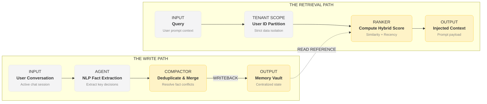

# RAG vs. AI Memory: Choosing the Right Approach for Long-Term Knowledge

Retrieval-Augmented Generation (RAG) is the default architectural pattern for connecting Large Language Models (LLMs) to custom data. In developer workflows, RAG is used to feed project documentation, codebases, and API specs into AI prompts.

However, developers using standard RAG tools frequently encounter issues: the AI pulls irrelevant chunks of code, gets confused by outdated documentation, and fails to connect related entities.

In this guide, we analyze why standard **vector-search RAG fails for developer workflows** and how a structured **AI Memory Layer** solves these problems.

---

## The Fallacy of Semantic Search

Traditional RAG treats relevance as a simple mathematical property of content. It splits text into fixed-size chunks, indexes them into a vector space, and retrieves the closest coordinates using cosine similarity at query time.

While this works well for search queries over static reference archives (like reading a legal PDF), it fails for interactive software engineering. Code development requires **statefulness, personalization, and cross-session continuity**. 

---

## Why Vector RAG Fails Developer Workflows

Standard RAG architectures have three major limitations when used for developer memory:

### 1. Read-Only Limitations
RAG pipelines are designed to be read-only on the query path. You run an ingestion script to chunk and embed your docs once, and the database remains static.
- **No Conversation Feedback**: RAG has no write path. If you correct the AI during a chat ("*No, we use Axios instead of Fetch*"), that correction stays in the active short-term context. The moment you clear the thread, the correction is deleted. The vector index remains unmodified, and the AI will make the same mistake in the next chat.

### 2. Cosine Similarity vs. Temporal Decay
Cosine similarity measures distance between vector coordinates, ignoring **when** the information was stored. 
- In development, codebases evolve rapidly. If you refactored your database model yesterday from MongoDB to PostgreSQL, both instructions now exist in your documentation or git logs. 
- Because both chunks are highly similar to a query like "*how is our database schema set up?*", standard similarity search will retrieve both records. The model receives contradictory context and is forced to guess, resulting in hallucinations and broken code.

### 3. Context Bloat and Fragmented Chunks
Standard chunking splits code files at arbitrary line limits (e.g., every 500 characters). This splits function signatures from their usage, imports, and surrounding class declarations.
- To prevent this, developers increase the chunk size and retrieve more chunks, which quickly consumes the active context window. 
- Wasting 20,000 tokens on redundant codebase files increases latency, increases API costs, and dilutes the model's focus.

---

## How AI Memory Layers Solve the RAG Problem

An **AI Memory Layer** like **Memwyre** is stateful, write-capable, and scope-aware. Instead of treating all text as static chunks, it manages information as an evolving profile of user preferences, codebase states, and rules.

### 1. The Write-Back Ingestion Loop
Unlike read-only RAG, Memwyre continuously runs an ingestion loop on the conversational history.
- **Extraction**: The system parses conversation logs, identifies explicit developer statements, and extracts facts (e.g., "*Developer prefers snake_case for database fields*").
- **Deduplication and Conflict Resolution**: When a new fact is extracted, Memwyre checks for existing semantic matches. If the new fact contradicts a stored record, the system updates the memory, deprecates the old statement, and logs the change.

### 2. Recency-Aware Ranking
To prevent outdated instructions from corrupting prompts, Memwyre ranks memories using a hybrid scoring algorithm:
\[ \text{Score} = (0.4 \times \text{Similarity}) + (0.35 \times \text{Recency}) + (0.25 \times \text{Importance}) \]

Where:
- **Similarity**: The cosine distance between the query embedding and the memory.
- **Recency**: A time-decay factor that reduces the weight of older entries:
  \[ R = e^{-\lambda t} \]
- **Importance**: A rating (1 to 5) determined by an LLM during extraction (e.g., security credentials or API routes get an importance rating of 5, while casual styling choices get a 2).

This ensures that critical, recently updated guidelines always take precedence.

### 3. Tenant Isolation and User Scopes
In production, a major hurdle for RAG is **user scoping**. If multiple developers share a vector index, their queries can bleed context into other profiles through similarity matches. 
- Memwyre implements **strict tenant isolation** at the database layer. 
- Memories are partitioned by user ID and project namespace before retrieval scoring begins. This ensures that developer A's project credentials can never be leaked to developer B's query window.

---

## Feature Comparison: RAG vs. AI Memory

| Capability | Traditional Vector RAG | Memwyre AI Memory Layer |
| :--- | :--- | :--- |
| **Database Operations** | Read-Only (on query path) | Read-Write (continuous update/merge loop) |
| **Retrieval Strategy** | Cosine Similarity only | Hybrid (Similarity + Recency + Importance) |
| **Information Lifespan**| Static (requires manual deletion) | Evolving (decays, updates, or deactivates) |
| **Context Form** | Fixed-size text chunks | Structured Entity Profiles & Facts |
| **Token Utilization** | High (large chunks, low signal-to-noise) | Low (dense, summarized facts only) |
| **Multi-Repo Sync** | Difficult (siloed indices) | Built-in (global cloud gateway synchronization) |

---

## Conclusion

Choosing between RAG and Memory depends on your task. For question-answering over static documents, traditional RAG is sufficient. But for personalizing AI assistants and maintaining workspace continuity across sessions, a stateful AI memory layer is essential.

Configure Memwyre for your IDE (Cursor, VS Code, or Claude Desktop) to experience the difference. Sign up today at [memwyre.tech](https://memwyre.tech).

