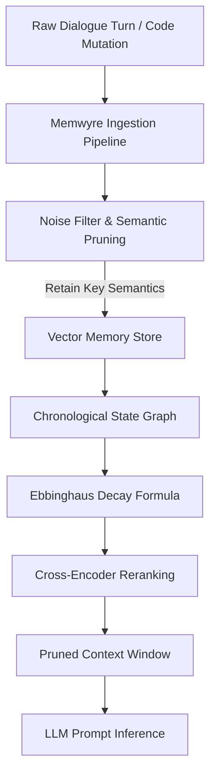

# State of AI Memory 2026: The Shift from Stateless to Stateful Agent Networks

As large language models (LLMs) continue to scale their context windows to millions of tokens, a common architectural misconception has emerged: that infinite context windows render long-term memory retrieval systems obsolete. 

In practice, the opposite is true. The year 2026 has marked a critical turning point where enterprise developer teams are realizing that stateless attention buffers are financially unsustainable, latency-prohibitive, and attention-dilutive for real-world agentic workflows. 

This whitepaper inspects the technical and mathematical overheads of stateless context expansion and details how stateful agent memory networks (such as Memwyre) resolve these issues by introducing logarithmic vector decay, dynamic context pruning, and persistent local/remote memory layers.

---

## 1. The Fallacy of Infinite Context

The premise of the "infinite context" model is simple: dump the entire codebase, user history, docs, and transcripts directly into the LLM prompt. While modern architectures (such as Mixture-of-Depths, Ring Attention, and state-space models) allow LLMs to ingest millions of tokens without throwing out-of-memory errors, they do not bypass the fundamental laws of information theory and compute complexity.

Standard Transformer architectures rely on the self-attention mechanism, where every token in the sequence computes a dot-product attention score with every other token. The computational complexity of this operation scales quadratically with sequence length:

\[ O(N^2 \cdot d) \]

Where \(N\) represents the sequence length (number of tokens) and \(d\) represents the hidden dimension size. As sequence length increases, the system encounters three critical bottlenecks:

### A. Financial Overhead
API providers charge for input tokens on every single query. If an autonomous agent needs to make 50 successive tool calls to solve a coding issue, and each tool call carries a 100k-token raw dialog history, the token expense compounds quadratically:

\[ C_{\text{total}} = \sum_{i=1}^{M} (T_{\text{static}} + T_{\text{history}} \cdot i) \cdot P_{\text{token}} \]

Where:
- \(M\) is the number of agent steps/turns.
- \(T_{\text{static}}\) is the static prompt size (system instructions, code snippets).
- \(T_{\text{history}}\) is the size of each dialog turn.
- \(P_{\text{token}}\) is the cost per input token.

For complex, long-running agent workflows, stateless context dumping results in prohibitive operational costs.

### B. Latency Penalties (Time-To-First-Token)
Although Key-Value (KV) cache reuse (such as vLLM page attention or prompt caching) helps mitigate generation latency, the Time-To-First-Token (TTFT) remains bounded by the time required to ingest and encode the incoming query relative to the existing prompt context. Pre-fill processing time grows linearly with the prompt context size:

\[ T_{\text{pre-fill}} \propto N \]

For a 100k+ token context, this pre-fill phase can take several seconds, breaking the real-time interaction loop needed for interactive developer agents and terminal integrations.

### C. Attention Dilution ("Lost in the Middle")
Transformers are fundamentally biased towards retrieval at the absolute beginning and end of the input context. As the context window expands, the model's retrieval accuracy for facts located in the middle of the prompt drops drastically. In autonomous coding agents, this attention dilution leads to:
- Missing critical configuration lines.
- Forgetting previous user preferences declared mid-session.
- Hallucinating variable or function signatures that were never defined.

---

## 2. Stateful Memory Architecture

Stateful memory networks solve agent amnesia by replacing the raw, stateless sliding window with a structured, active memory layer. Under this paradigm, the LLM is decoupled from the raw history. It communicates with a persistent memory co-processor that manages, prunes, and prioritizes memories dynamically.

### The Ingestion Pipeline
1. **Semantic Chunking:** Conversational inputs are split into coherent semantic blocks rather than arbitrary character bounds.
2. **Dynamic Pruning:** Filler text, ambient greetings, and redundant logs are stripped immediately.
3. **Logarithmic Decay (Forgetting Curve):** Memories are stamped with an initial importance score \(I_0\) that decays logarithmically as time passes without reinforcement:

\[ I(t) = I_0 \cdot e^{-\lambda t} \]

Where:
- \(\lambda\) is the decay coefficient.
- \(t\) is the elapsed turns or sessions since the memory was last recalled or reinforced.

This decay ensures that older, outdated user preferences are naturally superseded by newer preferences, preventing conflicts in the prompt context.

---

## 3. The Role of Vector Re-Ranking

A crucial mechanism of stateful memory is the two-stage retrieval pipeline:

1. **First-Stage (Dense Embedding Retrieval):** A fast vector search selects the top \(K\) (e.g., \(K=100\)) candidate memories using cosine similarity. This ensures high recall (Hit@10 ~88.8%).
2. **Second-Stage (Cross-Encoder Re-ranking):** A specialized cross-encoder model evaluates the query and candidate memories simultaneously, computing a precise relevance score. Only the top \(P\) (e.g., \(P=5\)) candidates are selected for the prompt context.

This dual-stage pipeline reduces the context footprint by up to **78.5%** (averaging 3,000 tokens instead of the raw 26,000+ token dialog logs) while retaining the critical facts required to synthesize the correct answer.

---

## 4. Practical Implementation: The Agentic Co-Processor

In 2026, persistent memory is transitioning from basic database queries to an active agentic co-processor. The system maintains three memory views:

*   **Episodic Memory:** Chronological logs of user interactions and agent execution steps.
*   **Semantic Memory:** A consolidated record of abstract facts, entities, codebase schemas, and verified user preferences.
*   **Episodic State Graph:** A relational graph tracking how entities and states evolve over time.

For example, when a developer queries: *"Which database configuration did we choose when setting up the container last week?"*, Memwyre does not scan the raw transcript history. It queries the semantic memory graph, filters by the decay threshold, and retrieves the exact configuration parameters in sub-300ms.

The shift from stateless prompt injection to stateful agent memory represents a critical paradigm shift in AI infrastructure. By moving computational overhead from the LLM attention buffer to a specialized memory co-processor, systems can bypass the quadratic cost and latency penalties of growing contexts. 

Dynamic context pruning, logarithmic vector decay, and two-stage cross-encoder re-ranking are not merely optimizations—they are foundational requirements for building persistent, reliable, and financially viable agentic networks capable of operating over infinite horizons.
