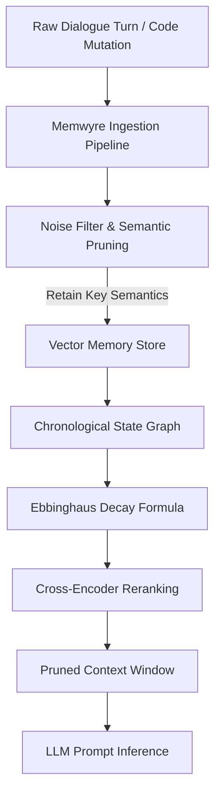

# State of AI Memory 2026: The Shift from Stateless to Stateful Agent Networks

> **TL;DR:** Infinite context windows suffer from quadratic compute scaling, high token costs, and attention dilution. Stateful memory networks solve this by actively pruning raw logs, applying temporal forgetting curves, and re-ranking memories—retaining only critical long-term facts above the fold to keep agent execution fast and cost-effective.

As large language models (LLMs) continue to scale their context windows to millions of tokens, a common architectural misconception has emerged: that infinite context windows render long-term memory retrieval systems obsolete. 

In practice, the opposite is true. The year 2026 has marked a critical turning point where enterprise developer teams are realizing that stateless attention buffers are financially unsustainable, latency-prohibitive, and attention-dilutive for real-world agentic workflows. 

This whitepaper inspects the technical and mathematical overheads of stateless context expansion and details how stateful agent memory networks (such as Memwyre) resolve these issues by introducing logarithmic vector decay, dynamic context pruning, and persistent local/remote memory layers.

---

## 1. The Fallacy of Infinite Context

The premise of the "infinite context" model is simple: dump the entire codebase, user history, docs, and transcripts directly into the LLM prompt. While modern architectures (such as Mixture-of-Depths, Ring Attention, and state-space models) allow LLMs to ingest millions of tokens without throwing out-of-memory errors, they do not bypass the fundamental laws of information theory and compute complexity.

Standard Transformer architectures rely on the self-attention mechanism, where every token in the sequence computes a dot-product attention score with every other token. The computational complexity of this operation scales quadratically with sequence length: `O(N² · d)`, where `N` represents the sequence length (number of tokens) and `d` represents the hidden dimension size. As sequence length increases, the system encounters three critical bottlenecks:

### A. Financial Overhead
API providers charge for input tokens on every single query. If an autonomous agent needs to make 50 successive tool calls to solve a coding issue, and each tool call carries a 100k-token raw dialog history, the token expense compounds quadratically:

```text
C_total = Σ [from i=1 to M] (T_static + T_history * i) * P_token
```

Where:
- `M` is the number of agent steps/turns.
- `T_static` is the static prompt size (system instructions, code snippets).
- `T_history` is the size of each dialog turn.
- `P_token` is the cost per input token.

For complex, long-running agent workflows, stateless context dumping results in prohibitive operational costs.

### B. Latency Penalties (Time-To-First-Token)
Although Key-Value (KV) cache reuse (such as vLLM page attention or prompt caching) helps mitigate generation latency, the Time-To-First-Token (TTFT) remains bounded by the time required to ingest and encode the incoming query relative to the existing prompt context. Pre-fill processing time grows linearly with the prompt context size:

`T_pre-fill ∝ N`

For a 100k+ token context, this pre-fill phase can take several seconds, breaking the real-time interaction loop needed for interactive developer agents and terminal integrations.

### C. Attention Dilution ("Lost in the Middle")
Transformers are fundamentally biased towards retrieval at the absolute beginning and end of the input context. As the context window expands, the model's retrieval accuracy for facts located in the middle of the prompt drops drastically. In autonomous coding agents, this attention dilution leads to:
- Missing critical configuration lines.
- Forgetting previous user preferences declared mid-session.
- Hallucinating variable or function signatures that were never defined.

---

## 2. Stateful Memory Architecture

Stateful memory networks solve agent amnesia by replacing the raw, stateless sliding window with a structured, active memory layer. Under this paradigm, the LLM is decoupled from the raw history. It communicates with a persistent memory co-processor that manages, prunes, and prioritizes memories dynamically.



### Detailed Step-by-Step Architecture Flow

The architecture diagram outlines the precise data path that transforms raw input events into highly condensed, query-relevant context prompts. Below is a detailed breakdown of how each step functions under the hood:

#### Step 1: Raw Dialogue Turn / Code Mutation
The pipeline triggers upon any active developer event. This includes chat inputs (conversational text), shell command executions, or code mutations (such as git diffs or file saves). Instead of passing this raw stream directly to the LLM context, it is treated as a transient event stream.

#### Step 2: Memwyre Ingestion Pipeline
The raw stream is decoupled and parsed using AST-aware syntax segmenters. Rather than cutting text at arbitrary token limits, it runs Tree-sitter AST parsers to chunk code at logical boundaries (such as complete class or function definitions) and resolves coreferences in dialogue (replacing pronouns with actual entity names) to keep segments self-contained.

#### Step 3: Noise Filter & Semantic Pruning
Ambient conversational noise ("Hey there!", "Thanks, that worked!") and diagnostic clutter (raw compiler progress bars, massive stack traces) are immediately filtered out. A lightweight classifier runs a binary classification step: discarding segments with zero persistent utility while retaining key semantic statements.

#### Step 4: Vector Memory Store
The filtered, high-utility chunks are passed to the embedding engine, where they are mapped to high-dimensional semantic vectors. This allows for fast similarity lookups based on topic cosine distance during the retrieval phase.

#### Step 5: Chronological State Graph
Retained vectors are not isolated key-value pairs; they are linked inside an Episodic State Graph. This graph tracks entity relations (e.g., matching a variable definition to a specific file node) and temporal links (tracking which code changes happened in what order), enabling the system to understand history chronologically.

#### Step 6: Ebbinghaus Decay Formula
To prevent old or contradictory memories from polluting the context window, every entity in the state graph is subjected to logarithmic temporal decay: `I(t) = I_0 · e^(-λt)`.

Where:
- `I_0` is the initial semantic importance score derived during ingestion.
- `λ` is the decay coefficient (configured based on memory type).
- `t` is the elapsed sessions or turns since the memory was last recalled or reinforced.

Unreinforced memories fade below retrieval thresholds, naturally resolving historical conflicts.

#### Step 7: Cross-Encoder Reranking
When a query is received, a two-stage retrieval pipeline runs:
1. **First-Stage (Dense Retrieval)**: Cosine search selects the top `K` (e.g., `K = 100`) candidate memories from the Vector Store.
2. **Second-Stage (Cross-Encoder Reranking)**: A specialized cross-encoder evaluates the query and candidates simultaneously, calculating exact relevance scores to narrow down the top candidate facts (e.g., the top `5` facts).

#### Step 8: Pruned Context Window
The top candidate facts from the reranker are assembled into a dense, compact prompt injection payload. This step reduces the overall token payload by up to **78.5%** (averaging 3,000 tokens instead of the raw 26,000+ token chat log).

#### Step 9: LLM Prompt Inference
Finally, the pruned context window is injected into the LLM system prompt. The model processes a clean, high-density, context-aware prompt with low latency and high attention focus, resulting in highly accurate response generation without attention dilution.

---

## 3. Benchmarking Long-Term Memory: The 2026 Landscape

Evaluating long-term memory systems is a contested domain. Direct vendor comparisons are frequently disputed due to differences in prompt configurations, database setups, and evaluation methodologies. To understand where the state of the art stands, we inspect the three primary benchmarks driving memory research:

### The Core Benchmarks

1. **LoCoMo (Long-term Conversational Memory)**: The most widely cited benchmark in memory papers. It tests an agent's ability to maintain consistency over multi-session dialogues. However, its average context size (~300 turns and ~9,000 tokens) is relatively modest by modern standards, it does not explicitly test real-time knowledge updates, and sources dispute its exact size (varying between 50 dialogues and 81 question-answer pairs).
2. **LongMemEval**: Evaluates five core memory capabilities: extraction, multi-session reasoning, temporal reasoning, knowledge updates, and abstention. It is divided into two scales: LongMemEval_S (~115K tokens, ~40 sessions) and LongMemEval_M (~500 sessions), representing the range where stateless context-stuffing completely breaks down.
3. **BEAM (ICLR 2026)**: The newest and most challenging benchmark, testing memory at 1M and 10M token scales via 100 long-range conversations and 2,000 probing questions. Designed specifically to prevent score saturation, no current memory architecture has saturated or "won" BEAM yet.

### SOTA Target Thresholds (July 2026)

Rather than evaluating individual vendor claims, a State-Of-The-Art (SOTA) memory network is expected to meet or exceed specific baseline thresholds across these benchmarks to be considered production-ready. Below are the target performance profiles and average SOTA metrics:

| Benchmark / Evaluation Metric | Average SOTA Target Score | Key Capabilities Tested | Context Footprint Constraints |
| :--- | :--- | :--- | :--- |
| **LoCoMo** | **90.0% – 93.0% Accuracy** | Multi-session consistency, long-range dialogue coherence. | Must run at **sub-3,000 tokens** per retrieval call (vs. ~7k token raw retrieval). |
| **LongMemEval (S)** | **90.0% – 95.0% Accuracy** | Extraction, multi-session reasoning, temporal updates, and abstention. | Must prevent context leakage over **100k+ tokens** of input history. |
| **BEAM (ICLR 2026)** | **70.0% – 75.0% Accuracy** | 1M and 10M token scale queries, complex multi-hop fact retrieval. | No architecture has saturated this benchmark yet; targets deep multi-hop routing. |

*Note: While full-context window stuffing establishes a theoretical ceiling of 87.52% accuracy on temporal and single-hop reasoning tasks, it does so at prohibitive token costs. A true SOTA memory layer must achieve these high accuracy targets while keeping the prompt payload compact and cost-efficient.*

---

## 4. Practical Implementation: The Agentic Co-Processor

In 2026, persistent memory is transitioning from basic database queries to an active agentic co-processor. Rather than acting as a passive document store, this co-processor runs asynchronously alongside the primary LLM loop, continuously updating and structuring three distinct memory views:

### The Three Memory Views

1. **Episodic Memory (The Narrative Log)**
   - **Focus**: Captures a sequential, high-fidelity log of session events—including user prompts, agent thoughts, file changes, terminal command outputs, and tool execution logs.
   - **Under the Hood**: Functions as a circular, time-bounded buffer. To prevent storage bloat, older episodes are processed asynchronously by a background worker to extract abstract facts before the raw logs are archived.

2. **Semantic Memory (The Knowledge Base)**
   - **Focus**: Serves as the consolidated repository of verified facts, permanent coding preferences, workspace rules, and structural constraints.
   - **Under the Hood**: Facts are stored as unified entities. When new observations contradict stored records (e.g., upgrading a dependency), a conflict-resolution pipeline deprecates the outdated node and commits the update.

3. **Episodic State Graph (The Temporal Web)**
   - **Focus**: Links semantic entities, files, and events into a multi-dimensional graph where edges represent relationships (e.g., `modified_by`, `imports`, `depends_on`) with temporal timestamps.
   - **Under the Hood**: Enables multi-hop reasoning. If a variable is declared in `config.py` and updated in `db.py`, the graph maintains the temporal links, allowing retrieval queries to walk the edges chronologically.

---

### Step-by-Step Retrieval Execution Flow

To see the co-processor in action, consider a developer asking: *"Which database configuration did we choose when setting up the container last week?"*

```text
[User Query] ──> [1. Dense Semantic Vector Search] ──> Cosine-matches "database configuration"
                      │
                      └──> [2. Graph Traversal] ───> Walks State Graph: container -> db -> config
                                │
                                └──> [3. Temporal Decay Filter] ───> Decays old/deprecated nodes
                                          │
                                          └───> [4. Dense Sub-300ms Payload Injection]
```

1. **Dense Semantic Vector Search**: A fast vector lookup retrieves candidate nodes from the Semantic Memory database matching query terms like "database configuration" and "container".
2. **Graph Traversal**: The co-processor walks the State Graph from the `container` entity node to locate adjacent database parameters and configuration files.
3. **Temporal Decay Filter**: The Ebbinghaus decay formula suppresses outdated container settings from previous months, selecting only the configurations reinforced or created within the "last week" window.
4. **Dense Sub-300ms Payload Injection**: The resolved parameters are packaged and injected into the LLM system prompt. The entire pipeline completes in under 300ms, completely bypassing the need to feed historical transcripts into the attention buffer.

---

## 5. Conclusion: The Stateful Future of AI

The shift from stateless prompt injection to stateful agent memory represents a critical paradigm shift in AI infrastructure. By moving computational overhead from the LLM attention buffer to a specialized memory co-processor, systems can bypass the quadratic cost and latency penalties of growing contexts. 

Dynamic context pruning, logarithmic vector decay, and two-stage cross-encoder re-ranking are not merely optimizations—they are foundational requirements for building persistent, reliable, and financially viable agentic networks capable of operating over infinite horizons.
