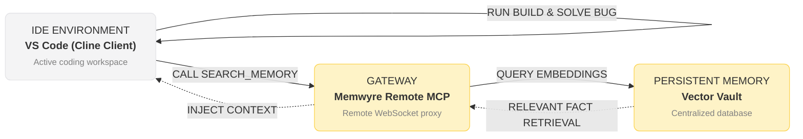

# How to Enable Persistent Codebase Memory in VS Code with MCP and Cline

AI-assisted coding in VS Code has evolved rapidly from simple inline autocomplete (like GitHub Copilot) to powerful, agentic systems that can read entire workspaces, execute commands, run tests, and write complex files. Extensions like **Cline**, **Roo-Code**, and **Devins** lead this revolution.

However, these autonomous agents share a common bottleneck: **they are stateless across sessions**. When you reset a conversation, close VS Code, or start working in a new workspace, the agent forgets all the context, research notes, and debugging discoveries you made.

By integrating **Memwyre** with Cline or Roo-Code using the Model Context Protocol (MCP), you can equip your VS Code agents with persistent memory that grows smarter with every task.

---

## The Amnesia Problem in IDE Agents

If you use agentic coding extensions in VS Code, you've likely encountered these repetitive tasks:
- **Redundant Directory Scans**: The agent scans the root directory, lists files, reads the `package.json`, and recursively checks folders at the beginning of every task. This wastes thousands of tokens on static codebase context.
- **Context-Amnesia during Hydration**: Explaining your design conventions or configuration choices (e.g., Tailwind CSS v4 vs. v3) every time you start a new task.
- **Logical Loops**: When an agent hits a compilation bug, it tries the same three invalid solutions it tried in the previous chat because it has no memory of the failed approaches.

An MCP-based memory layer solves this by providing a unified vault that your VS Code agents can access and update automatically.



---

## Local vs. Remote MCP Memory

When configuring memory for VS Code agents, you can run a local database script or connect to a remote gateway.

- **Local MCP**: Runs a Node.js daemon that connects to a local JSON file or SQLite file. The drawback is that this memory is tied to a single machine and cannot be accessed by your browser extensions, terminal CLI tools, or other developers on your team.
- **Remote MCP Gateway**: Syncs memories securely to a cloud-hosted vault. Memwyre acts as a secure remote gateway. This guarantees that if you teach Cline a formatting preference in VS Code, that preference is instantly known by Claude Code running in your terminal, and your web-based chat assistant.

---

## Step-by-Step Integration

Follow these steps to configure your VS Code agent:

### 1. Copy your Memwyre API Key
Log into the **Memwyre Dashboard**, navigate to **Settings → API Keys**, and copy your personal API token.

### 2. Enable MCP in Cline/Roo-Code
1. Open the Cline or Roo-Code panel in the VS Code sidebar.
2. Click the **Settings (gear icon)** at the top right of the panel.
3. Scroll to the **MCP Mode** section and ensure it is active.

### 3. Configure the Memwyre MCP Server
Click **Edit MCP Config** in the extension settings. This will open `cline_mcp_settings.json` (or `roo_code_mcp_settings.json`).

Edit the JSON file to define the `memwyre` server using the remote WebSocket gateway:

```json
{
  "mcpServers": {
    "memwyre-memory": {
      "command": "npx",
      "args": [
        "-y",
        "@memwyre/mcp-server"
      ],
      "env": {
        "MEMWYRE_API_KEY": "YOUR_MEMWYRE_API_TOKEN"
      }
    }
  }
}
```

*Replace `YOUR_MEMWYRE_API_TOKEN` with your actual Memwyre API key.*

### 4. Save and Verify Connection
Save the configuration file. The extension will automatically reload. In the extension's MCP tab, you will see `memwyre-memory` listed as **Connected** with active tools like `save_memory`, `search_memory`, and `list_memories`.

---

## How to Leverage Persistent Memory

Once connected, you don't need to manually run tools. The agent will autonomously decide when to store a new memory or retrieve a past one. 

Here are some ways to seed your VS Code memory:

### Seed Architecture Guides
Tell the agent:
> "Remember: For this repository, all Vue components must reside in `/src/components/` and use the Composition API with `<script setup>`. Do not use Options API."

The agent will write this rule to Memwyre. In any future chat session, the agent will recall this preference and write code accordingly.

### Save Debugging Discoveries
When the agent successfully resolves a complex environment issue or library conflict, prompt it:
> "Save a memory explaining how we fixed the hydration error in our SSR configuration."

This prevents the agent from repeating the same debugging loops next time the issue arises.

---

## Conclusion

By configuring Memwyre as a remote MCP server inside VS Code, you transform Cline, Roo-Code, and Devins from single-session utilities into highly customized context-aware partners.

Start giving your VS Code agents a persistent brain today at [memwyre.tech](https://memwyre.tech).

