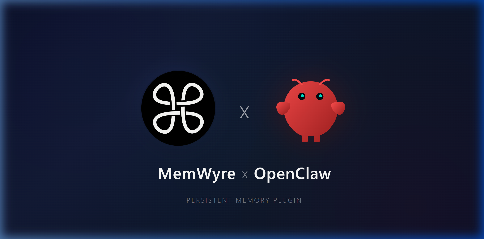

<p align="center">
  <a href="https://www.npmjs.com/package/@memwyre/openclaw-plugin"></a>
  <a href="https://www.npmjs.com/package/@memwyre/openclaw-plugin"></a>
  <a href="https://opensource.org/licenses/MIT"></a>
  <a href="https://www.npmjs.com/package/@memwyre/openclaw-plugin"></a>
</p>

# OpenClaw MemWyre Plugin

This plugin enables the OpenClaw autonomous agent to seamlessly use MemWyre as its persistent memory and context engine. It provides the agent with first-class tools to save notes and retrieve context from the MemWyre Vault.

## Installation

Assuming you have OpenClaw installed, you can link or copy this directory into your OpenClaw plugins directory, or install it via the OpenClaw CLI using the local path.

1. Ensure dependencies are installed in this plugin folder:
   ```bash
   cd openclaw-plugin
   npm install
   ```

2. Register the plugin with OpenClaw:
   ```bash
   openclaw plugins install /path/to/openclaw-plugin
   ```

## Configuration

You must configure the plugin in your OpenClaw settings (usually `~/.openclaw/config.json` or via OpenClaw's plugin management CLI) with your MemWyre API key.

```json
"plugins": {
    "entries": {
      "openclaw-plugin": {
        "enabled": true,
        "config": {
          "apiKey": "bv_sk_your_api_key_here",
          "hostUrl": "https://server.memwyre.tech"
        }
      }
    }
}
```

- **`apiKey`**: Generate this from the MemWyre web interface under Settings > API Keys.
- **`hostUrl`**: The URL where your MemWyre backend is running. Defaults to `https://server.memwyre.tech`.

## Important: Agent Tool Profile

OpenClaw isolates tools based on agent capability profiles to prevent token overload. 
To ensure the `save_memory` and `search_memwyre` tools are injected into your OpenClaw agent session, you **must set your agent tool profile to `full` or `coding`**. 

If your profile is set to standard or bare minimum, OpenClaw will artificially disable these custom memory plugins!

## Tools Provided

Once configured, the OpenClaw agent will have access to the following tools:
- **`save_memory(text, tags)`**: Saves a new memory/note directly into your MemWyre Inbox.
- **`search_memwyre(query)`**: Performs semantic search across your MemWyre Vault to retrieve past context.
