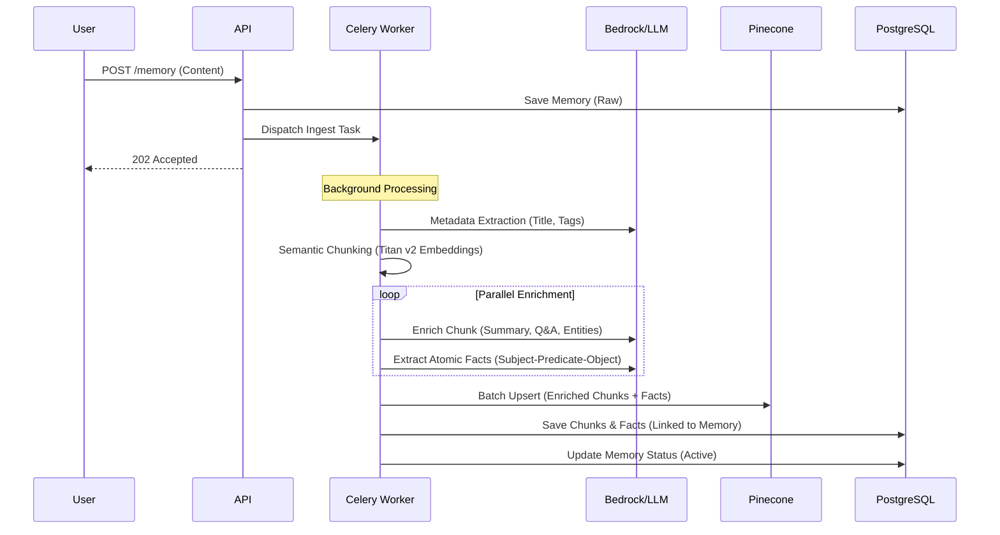
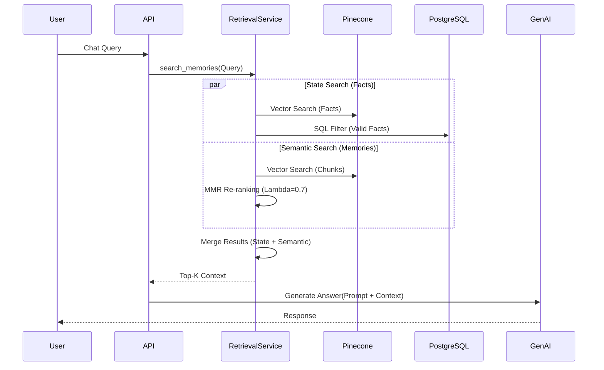
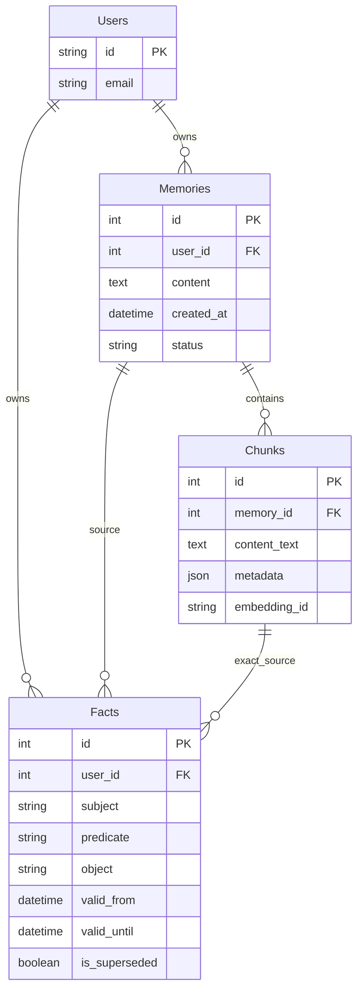

# System Design - Brain Vault (Current Architecture)

## 1. High-Level Architecture (Component View)

```mermaid
flowchart TB
    subgraph Client_Side [Client Side]
        Browser["WebApp (Vue.js)"]
        Extension["Chrome Extension"]
    end

    subgraph Load_Balancer [Ingress]
        Nginx["Reverse Proxy / LB"]
    end

    subgraph Backend_Core [Backend API (FastAPI)]
        Auth_Mod["Auth & Users"]
        Mem_Mod["Memory Management"]
        Ret_Mod["Retrieval Service"]
        LLM_Mod["LLM Service"]
    end

    subgraph Background_Workers [Celery Workers]
        Ingest_Worker["Ingestion Worker"]
        Dedupe_Worker["Deduplication Worker"]
    end

    subgraph Data_Persistence [Data Layer]
        Postgres[("PostgreSQL - Users, Facts, Chunks")]
        Pinecone[("Pinecone - Vector Index")]
        Redis[("Redis - Celery Broker")]
    end
    
    subgraph External_Services [AI Providers]
        Bedrock["AWS Bedrock (Nova Pro / Titan v2)"]
        OpenAI["OpenAI (GPT-4o)"]
        Gemini["Google Gemini"]
    end

    Browser -->|HTTPS| Nginx
    Extension -->|HTTPS| Nginx
    Nginx --> Backend_Core
    
    Auth_Mod --> Postgres
    
    Mem_Mod --> Postgres
    Mem_Mod --> Ingest_Worker
    
    Ret_Mod --> Pinecone
    Ret_Mod --> Postgres
    Ret_Mod --> External_Services
    
    Ingest_Worker --> External_Services
    Ingest_Worker --> Pinecone
    Ingest_Worker --> Postgres
```

## 2. Core Workflows

### 2.1 Advanced Ingestion Pipeline
The ingestion process is asynchronous and heavily enriched using LLMs.



### 2.2 Parallelized Retrieval (RAG)
Retrieval combines exact Fact lookups with fuzzy Semantic Search in parallel for low latency.



## 3. Database Schema (Key Entities)



## 4. Technology Stack (Current)

```json
{
  "system": "Brain Vault",
  "layers": [
    {
      "name": "Backend",
      "tech": ["FastAPI", "Python 3.12+", "Celery", "SQLAlchemy (Async)"],
      "deployment": "Uvicorn"
    },
    {
      "name": "AI / ML",
      "embeddings": "Amazon Titan Text v2 (via Boto3)",
      "inference": ["AWS Bedrock (Nova Pro)", "OpenAI (GPT-4o)", "Gemini 1.5 Pro"],
      "vector_db": "Pinecone (Serverless)"
    },
    {
      "name": "Data",
      "primary_db": "PostgreSQL",
      "queue": "Redis"
    }
  ]
}
```
